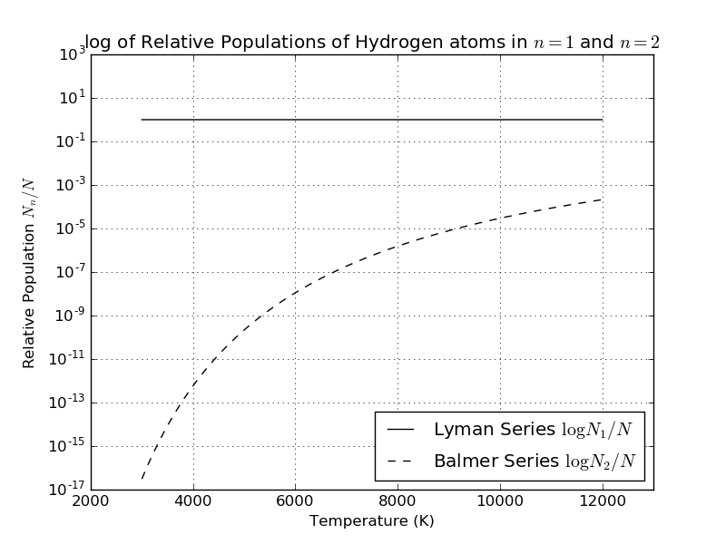

plawt - JSON-like sugar for matplotlib
============
Because sometimes you just want a good looking plot goddamnit.
I don't like context switching from physics to python, and hopefully this will let me do less of it.

Installation
============
`pip install plawt` and then `import plawt` in your python file.
Current version is [here](https://pypi.python.org/pypi/plawt/).

Features
========
See  the examples folder for how to use `plawt` to make subplots, step plots, and other less common uses.

In addition to any usual single panel plot `plawt` also wraps these matplotlib features:

* Arbitrary subplot grids, spacing between subplots
* Step Plots
* Log plots
* legends, legend locations, legend labels
* labelling, subplot titles (with location), super titles, font-size tweaking
* x limits, y limits,
* marker and linestyle, alpha, drawstyle
* saving figures, showing figures to screen
* tight_layout
* matplotlib style (`plt.style.use()`)
* Tick parameters (`axes.tick_params`)

Example
=======
Here's a simple logarithmic plot that shows why the strength of Balmer lines varies in different colored stars:


Here's the code for that plot using `plawt`:
```python
from __future__ import division
from math import pi
from numpy import exp, sqrt, log10, e
import numpy as np
import plawt

### Functions to generate the data
# excitation potential
def Xn(n): return 13.6*(1-1/n**2)

# Boltzmann equation, N_n/N
def excitationEq(n, T):
	k = 8.63e-5 # eV/K
	gn = 2*n**2; Z = 2 # hydrogen atom
	return (gn/Z) * exp(-Xn(n)/(k*T))

T = np.arange(3000, 12000, 1)

### now all the data and metadata about the plot:
myplot = {
	0: {	# 'first' line
		'x': T,
		'y': excitationEq(1, T),
		'line': 'k-',
		'label': 'Lyman Series $\log{N_1 / N}$'
	},
	1:{		# 'second' line
		'x': T,
		'y': excitationEq(2, T),
		'line': 'k--',
		'label': 'Balmer Series $\log{N_2 / N}$'
	},
	'xlabel': 'Temperature (K)',
	'ylabel': 'Relative Population $N_n / N$',
	'title': 'log of Relative Populations of Hydrogen atoms in $n=1$ and $n=2$',
	'set_yscale': 'log',
	'grid': True,
	'legend': {'loc':4},
	'ylim': (10e-18, 10e2),
	'xlim': (2000,13e3),
	'filename': 'excitation_logarithmic.png',
	'show': True
}

### fire away fire awaaay
plawt.plot(myplot)

```

The plot is also saved. I prefer this because I can glance at what is completely
just information about the physical problem I'm working on. What are my labels? What is my data? What are my limits? Is it a log scale? Plus a few extra aesthetic things like grid, line color, the name of the file it's being saved as, etc.

The same plot above is written like this without `plawt`:

```python
plt.plot(T, excitationEq(1, T), 'k-', label='Lyman Series $\log{N_1 / N}$')
plt.plot(T, excitationEq(2, T), 'k--', label='Balmer Series $\log{N_2 / N}$')
plt.xlabel('Temperature (K)'); plt.ylabel('Relative Population $N_n / N$')
plt.title('log of Relative Populations of Hydrogen atoms in $n=1$ and $n=2$')
plt.gca().set_yscale('log')
plt.legend(loc=4)
plt.grid()
plt.ylim((10e-18,10e2))
plt.xlim((2000, 13e3))
plt.savefig('excitation_logarithmic.png')
plt.close()
```

Usage
=====
There is only one exposed method:

```python
plawt.plot(plotDictionary)
```

You specify your plot in a python dictionary, here called `plotDictionary`.
Each line (data series) in your plot should be indexed by an __integer__ key. The actual integer doesn't matter but I like to go 0, 1, 2, ...

I define my data series before anything else.

```python
plotDictionary = {
	0: {
		'x': [1, 2, 3, 4, 5, 6],
		'y': [1, 2, 3, 4, 5, 6],
		'line': 'k-' # black, solid, like in matplotlib docs
	}
}
```

The value of the '0'th line is another dictionary. The only mandatory fields are 'x' and 'y'. The 'line' field is optional as well as 'label'.

In fact every field except for a 'x' and 'y' is optional.

__Note: Not every pyplot field is implemented!__
I add fields as I need them. Send me pull requests if you'd like something added.

I try to keep a one-to-one mapping between the fields in `plawt` and in `matplotlib`:

Add an xlabel the same way as in `matplotlib`:

```python
plt.xlabel('numbers<3')

## OR ##

plotDictionary = {
	0: {
		'x': [1, 2, 3, 4, 5, 6],
		'y': [1, 2, 3, 4, 5, 6],
	},
	'xlabel': 'numbers<3'
}
```

The values of some fields also match with their `matplotlib` counterparts:
eg. a log scale:

```python
plt.gca().set_yscale('log')

## OR ##

plotDictionary = {
	0: {
		'x': [1, 2, 3, 4, 5, 6],
		'y': [1, 2, 3, 4, 5, 6],
	},
	'set_yscale': 'log'
}
```

By default `plawt` will close your plot automatically after showing it to you or saving it to a file. If you set `'keepOpen':True` you can take the return value and use it to do more things to your plot that haven't been implemented yet:

```python
plotDictionary = {
	0: {
		'x': [1, 2, 3, 4, 5, 6],
		'y': [1, 2, 3, 4, 5, 6],
	},
	'keepOpen': True
}

plt = plawt.plot(plotDictionary)
plt.gca(). etc etc
plt.savefig('yo.png')
plt.show

## Or even just
plawt.plot(plotDictionary).show()
```

And that's the waaaaay it goes

---
Copyright © 2017 Mohammed Chamma

MIT License


